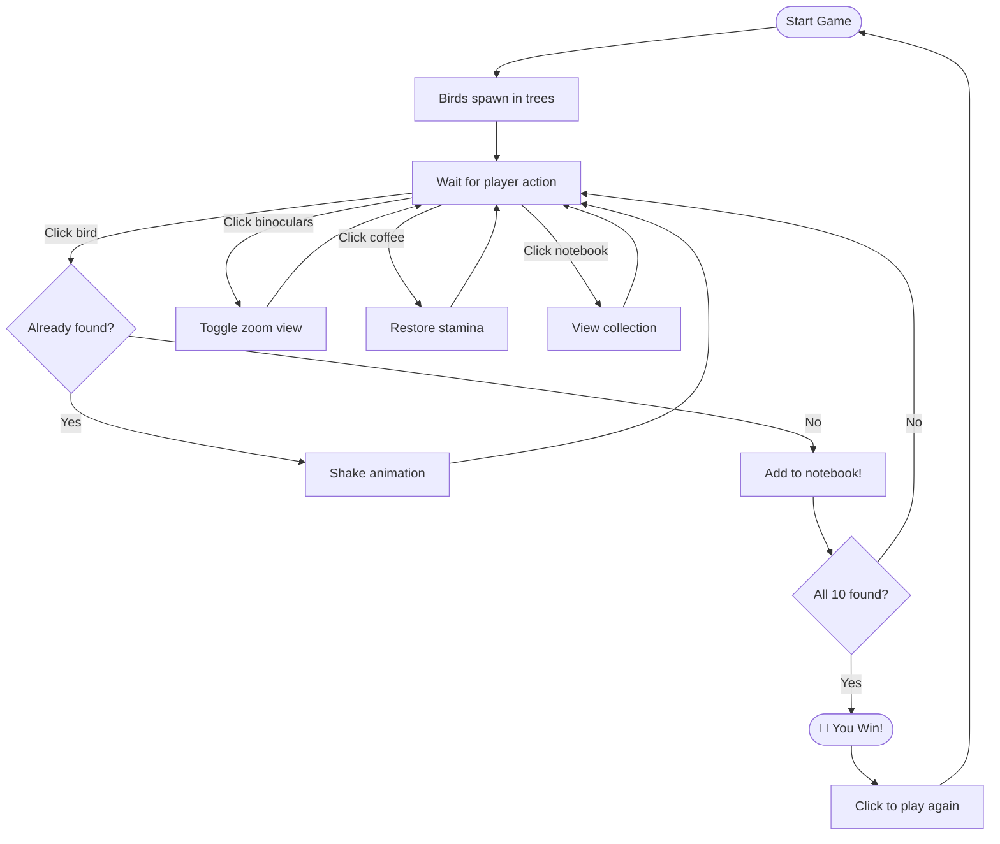

#  Bird Watching - A Pixel Art Browser Game

Spot birds from your window, drink coffee to stay energized, and fill your notebook with all 10 bird species!


##  About the Game

You're sitting at a cozy table near a window, with a coffee maker, a notebook, and binoculars. Outside, birds fly between the trees. Your goal is to spot all 10 different bird species and record them in your notebook.

##  How to Play

1. **Spot Birds** - Click on birds through the window to record them in your notebook
2. **Use Binoculars** - Click the binoculars to zoom in and see distant birds more clearly
3. **Drink Coffee** - Click the coffee maker to refill your stamina when it gets low
4. **Check Your Notebook** - Click the notebook to see which birds you've found
5. **View Map** - Click the map in the bottom-right to open the world map (travel coming soon!)
6. **Win** - Find all 10 different birds to complete your collection!

##  Features

- **Pixel Art Style** - Retro 8-bit aesthetic with custom assets
- **10 Unique Birds** - Robin, Cardinal, Blue Jay, Goldfinch, Hummingbird, Owl, Eagle, Duck, Swan, and Peacock
- **Layered Background System** - Animated sky, drifting clouds, and scenic trees
- **Stamina System** - Manage your energy with coffee breaks
- **Binoculars Mode** - Zoom in to spot distant birds with a dual lens effect
- **Notebook Tracking** - Lined paper notebook that fills up as you discover birds
- **Map Widget** - Expandable world map in the bottom-right corner
- **Responsive Design** - Works on desktop, tablet, and mobile devices

## 🛠️ Tech Stack

- **HTML5** - Game structure
- **CSS3** - Pixel art styling, animations, and effects
- **JavaScript (ES6+)** - Game logic and interactivity
- **No external dependencies** - Pure vanilla JavaScript!

## 📱 Responsive Design

The game automatically adapts to different screen sizes:

- **Desktop (1200px+)** - Full-sized game experience
- **Tablet (≤768px)** - Adjusted item positions and sizes
- **Mobile (≤480px)** - Compact layout with smaller UI elements

The layout fluidly adjusts when resizing the browser window!

##  Installation

1. Clone the repository:
```bash
git clone https://github.com/yourusername/bird-watching.git
cd bird-watching
```

2. Open `index.html` in your web browser:
   - Double-click the file, or
   - Right-click → "Open with" → Your browser, or
   - Use a local server (optional):
   ```bash
   # Python 3
   python -m http.server 8000
   # Node.js
   npx serve
   ```

3. Play and enjoy! No build process required.

##  Game Controls

| Action | How |
|--------|-----|
| Spot a bird | Click on a bird in the window |
| Toggle binoculars | Click the binoculars |
| Drink coffee | Click the coffee maker |
| Open notebook | Click the notebook |
| Open/close map | Click the map widget (bottom-right) |
| Restart game | Click "Play Again" after winning |

##  Game Flow



##  Project Structure

```
bird-watching/
├── index.html          # Main HTML structure
├── style.css           # Pixel art styling with responsive design
├── game.js             # Game logic and interactivity
├── assets/             # Game assets organized by type
│   ├── scene/          # Background elements
│   │   ├── sky-gradient.png
│   │   ├── clouds.png
│   │   ├── trees.png
│   │   └── window-table.png
│   ├── items/          # Interactive items
│   │   ├── coffee-maker.png
│   │   ├── binoculars.png
│   │   └── notebook.png
│   └── ui/             # User interface elements
│       └── map.png
└── README.md           # This file
```

##  Customization

### Asset Placement

Place your pixel art images in the `assets/` folder:

**Scene Assets** (`assets/scene/`):
- `window-table.png` - Combined window + table foreground (900×400px recommended)
- `sky-gradient.png` - Sky background
- `clouds.png` - Cloud sprite for animation
- `trees.png` - Trees/landscape background

**Item Assets** (`assets/items/`):
- `coffee-maker.png` - Coffee maker sprite (~100×100px recommended)
- `binoculars.png` - Binoculars sprite (~60×60px recommended)
- `notebook.png` - Notebook sprite (~250×180px recommended)

**UI Assets** (`assets/ui/`):
- `map.png` - World map image (full size, mini version is auto-cropped)

### Positioning & Scaling

All item positions can be easily adjusted in `style.css`. Look for the commented sections:

```css
/* ========== ITEMS POSITIONING & SCALING ========== */
/* Coffee Maker */
.coffee-maker {
    left: 58%;         /* Move left/right */
    bottom: 70%;       /* Move up/down */
    max-width: 80px;   /* Size */
}

/* Similar controls for notebook, binoculars, map, clouds, etc. */
```

### Background Adjustments

```css
/* ========== BACKGROUND POSITION ADJUSTMENTS ========== */
.scene-background {
    top: 2%;          /* Window area position from top */
    left: 4%;         /* Window area position from left */
    width: 95%;       /* Window area width */
    height: 58%;      /* Window area height */
}

.sky-bg {
    transform: translateX(0%);  /* Move sky horizontally */
}

.trees-bg {
    transform: translateX(-8%); /* Move trees horizontally */
}
```

##  Bird List

| # | Bird | Emoji |
|---|------|-------|
| 1 | Robin | 🐦 |
| 2 | Cardinal | 🔴 |
| 3 | Blue Jay | 🔵 |
| 4 | Goldfinch | 🟡 |
| 5 | Hummingbird | 🐝 |
| 6 | Owl | 🦉 |
| 7 | Eagle | 🦅 |
| 8 | Duck | 🦆 |
| 9 | Swan | 🦢 |
| 10 | Peacock | 🦚 |

##  Credits

- **Game Design & Development** - Vihtori
- **Pixel Art Assets** - Vihtori
- **Font** - [Press Start 2P](https://fonts.google.com/specimen/Press+Start+2P) by Code New Roman

##  License

This project is open source and available under the [MIT License](LICENSE).

##  Contributing

Contributions are welcome! Feel free to:
- Report bugs
- Suggest new features
- Submit pull requests
- Add new bird species

##  Contact

Have questions or feedback? Open an issue on GitHub!

---

**Made for bird lovers everywhere**
